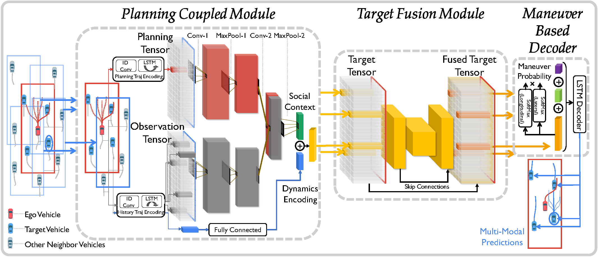

# Planning-informed Trajectory Prediction (PiP)

The official implementation of "[PiP: Planning-informed Trajectory Prediction for Autonomous Driving](http://song-haoran.com/planning-informed-prediction)"
(ECCV 2020),

by [Haoran Song](https://haoran-song.github.io/), [Wenchao Ding](https://wenchaoding.github.io/), [Yuxuan Chen](),
[Shaojie Shen](http://uav.ust.hk/), [Michael Yu Wang](https://seng.ust.hk/about/people/faculty/michael-yu-wang/) and [Qifeng Chen](https://cqf.io/).

<p align="center"></p>

Inform the multi-agent future prediction with ego vehicle's planning in a novel planning-prediction-coupled pipeline.

For more details, please refer to our
[project website](http://song-haoran.com/planning-informed-prediction)
/ [paper](https://link.springer.com/chapter/10.1007/978-3-030-58589-1_36)
/ [arxiv](https://arxiv.org/abs/2003.11476).


## Dependencies

```shell
conda create -n PIPrediction python=3.7
source activate PIPrediction

conda install pytorch==1.2.0 torchvision==0.4.0 cudatoolkit=10.0 -c pytorch
conda install tensorboard=1.14.0
conda install numpy=1.16 scipy=1.4 h5py=2.10 future
```

## Download
- Raw datasets: download [NGSIM](https://data.transportation.gov/Automobiles/Next-Generation-Simulation-NGSIM-Vehicle-Trajector/8ect-6jqj) and [highD](https://www.highd-dataset.com/), then process them into the required format (.mat) using the preprocessing [code](https://github.com/Haoran-SONG/PiP-Planning-informed-Prediction/tree/master/preprocess).
- Processed datasets: download from this [link](https://hkustconnect-my.sharepoint.com/:f:/g/personal/hsongad_connect_ust_hk/Evo9MNDPLhZAn-ygM1-GOVQB-ULdHzx4WurTZ1j-Bk_JNQ?e=YdG7Xk) and save them in datasets/.
- Trained models: download from this [link](https://hkustconnect-my.sharepoint.com/:f:/g/personal/hsongad_connect_ust_hk/EtttBXgentVNhb3QuYSaK2kBTh0vbL0sno1S3p9bnuKcFA?e=9wb7rQ) and save them in trained_models/.

## Running

Training by `sh scripts/train.sh` or running
```shell
python train.py --name ngsim_demo --batch_size 64 --pretrain_epochs 5 --train_epochs 10 \
    --train_set ./datasets/NGSIM/train.mat \
    --val_set ./datasets/NGSIM/val.mat
```

Test by `sh scripts/test.sh` or running
```shell
python evaluate.py --name ngsim_model --batch_size 64 \
    --test_set ./datasets/NGSIM/test.mat
```

## Documentation
- model.py : It contains the concrete details of the proposed PiP architecture.
- train.py : It contains the detailed approach for training PiP model.
All the network parameters are provided by the default values.
- evaluate.py : It contains the approach for evaluating a trained model.
The prediction precision is reported by RMSE & NLL values at future time frames.
- data.py : It contains the customized dataset class for handling and batching trajectory data
- utils.py : It contains the loss calculation functions and some other helper functions.
- preprocess/ : It contains Matlab code for preprocessing the raw data from NGSIM or HighD into the required format.


## Citation
If you find our work useful in your research, please citing:

```bibtex
@InProceedings{song2020pip,
author = {Song, Haoran and Ding, Wenchao and Chen, Yuxuan and Shen, Shaojie and Wang, Michael Yu and Chen, Qifeng},
title = {PiP: Planning-informed Trajectory Prediction for Autonomous Driving},
booktitle = {The European Conference on Computer Vision (ECCV)},
month = {August},
year = {2020}
}
```
